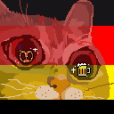
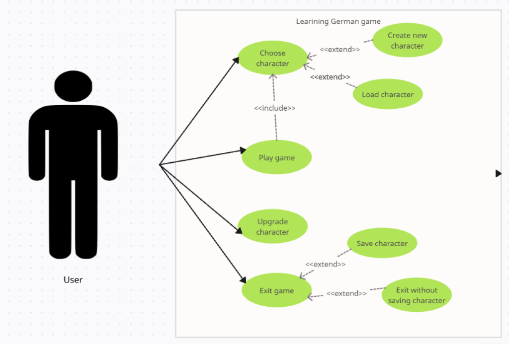
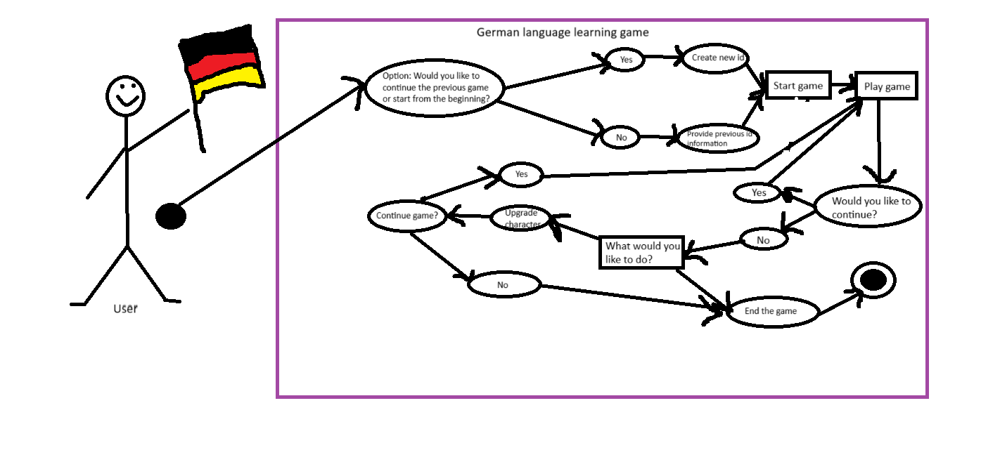

# Katugem

## Grow your German!

Grupinis Objektinio Programavimo (C++) modulio projektas.
Komandos nariai:
- Emilija Sankauskaitė (5 grupė)
- Ugnius Teišerskis (1 grupė)

### Tikslas:
Sukurti žaidimą, kuriame būtų galima mokytis vokiečių kalbos pagrindų per įvairius interaktyvius žaidimus. Užduotys bus paimtos iš kelių mokomųjų knygų, kur su kiekviena užduotimi vartotojas galės užsidirbti pinigų, kuriuos galės iškeisti į maistą savo virtualiam augintiniui.

`Pažymio pasiskirstymas tarp komandos narių visuose etapuose yra 50/50.`

## P1 (2025/04/15):

- Sukūrėme project-specific "Hello world!", kuriame pademonstravome savo projekto viziją.
- Pristatėme užduočių ir veiklos diagramas, kurias įgyvendinsime antrame ir trečiame etapuose.
- Etapo metu pyldėme tiek grupinę, tiek individualias laiko fiksavimo formas.

### Demonstracija
Nuoroda į vaizdo įrašą, kuriame pademonstruojamas programos kompiliavimas ir paleidimas: https://youtu.be/Bg7e9gJNCuA.

### Užduočių diagrama

### Veiklos diagrama

## P2 (2025/05/15):

- Pilnai įgyvendinome projekto "back-end" funkcionalumą.
- Funkcionalumui įgyvendinti panaudojome "Strategy" projektavimo šabloną.
- Paruošėme testus, įrodančius, jog mūsų modulių funkcionalumas yra korektiškas.
- Klasių sąryšius pademonstravome sukurdami UML klasių diagramą.

