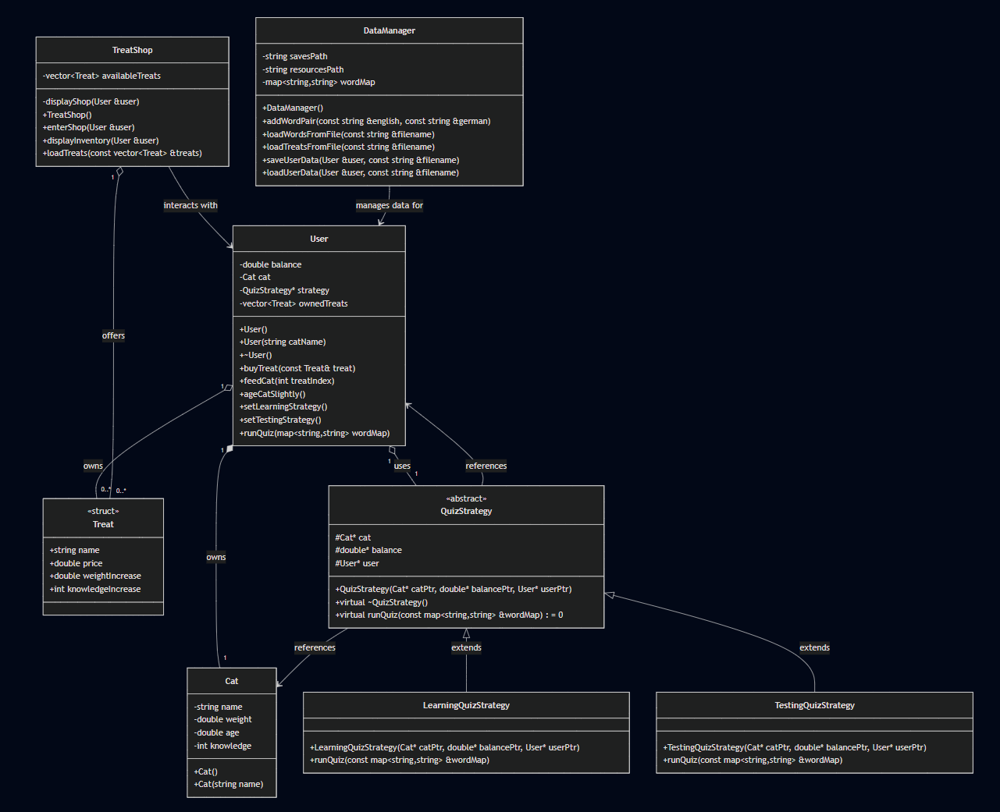

# Katugem


## Grow your German!


Grupinis Objektinio Programavimo (C++) modulio projektas.
Komandos nariai:
- Emilija Sankauskaitė (5 grupė)
- Ugnius Teišerskis (1 grupė)

### Tikslas:
Sukurti programą, kurioje būtų galima mokytis vokiečių kalbos pagrindų per interaktyvius žaidimus. Užduotys bus paimtos iš kelių mokomųjų knygų, kur su kiekviena užduotimi vartotojas galės užsidirbti pinigų, kuriuos galės iškeisti į maistą savo virtualiam augintiniui ir padėti jam augti!

`Pažymio pasiskirstymas tarp komandos narių visuose etapuose yra 50/50.`

## P1 (2025/04/15):

- Sukūrėme project-specific "Hello world!", kuriame pademonstravome savo projekto viziją.
- Pristatėme užduočių ir veiklos diagramas, kurias įgyvendinsime antrame ir trečiame etapuose.
- Etapo metu pyldėme tiek grupinę, tiek individualias laiko fiksavimo formas.

### Programos paleidimas
Programą sukompiliuoti ir paleisti galima Windows operacinės sistemos įrenginyje nuėjus terminalu į projekto katalogą ir įvedus šias komandas: 
```
make app
.\app.exe
```

### Demonstracija
Nuoroda į vaizdo įrašą, kuriame pademonstruojamas programos kompiliavimas ir paleidimas: https://youtu.be/Bg7e9gJNCuA.

### Užduočių diagrama


### Veiklos diagrama


## P2 (2025/05/15):

- Pilnai įgyvendinome projekto "back-end" funkcionalumą.
- Funkcionalumui įgyvendinti panaudojome "Strategy" projektavimo šabloną.
- Paruošėme testus, įrodančius, jog mūsų modulių funkcionalumas yra korektiškas.
- Klasių sąryšius pademonstravome sukurdami UML klasių diagramą.

### Programos paleidimas
Programą sukompiliuoti ir paleisti galima Windows operacinės sistemos įrenginyje nuėjus terminalu į projekto katalogą ir įvedus šias komandas: 
```
make test
.\test.exe
```

### Demonstracija
Nuoroda į vaizdo įrašą, kuriame pademonstruojamas testų scenarijų kompiliavimas ir paleidimas: https://youtu.be/O7fwvlANOy0.

### UML klasių diagrama



## P3 (2025/05/28):

- Sujungėme visus skirtingus žaidimo modulius į vieną aplikaciją.
- Sukūrėme savo žaidimui vartotojo sąsają, kuri pilnavertiškai leidžia tobulinti savo vokiečių kalbos žinias bei auginti savo katinuką.

### Žaidimo paleidimas
Žaidimą sukompiliuoti ir paleisti galima Windows operacinės sistemos įrenginyje nuėjus terminalu į projekto katalogą ir įvedus šias komandas: 
```
make app
.\app.exe
```

## Demonstracija

Labai paprasta žaidimo demonstracija, kuri parodo nedidelę dalį mūsų žaidimo funkcionalumo: https://youtu.be/QZdOJAteIL8.

# Smagaus naudojimo!


